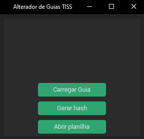
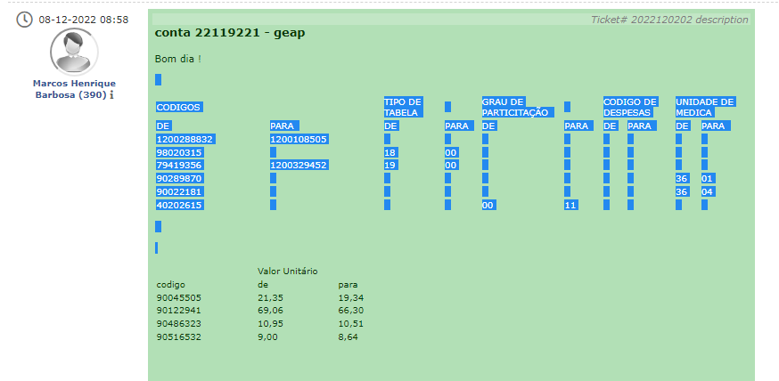
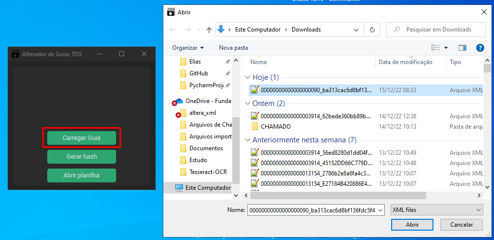

# Como usar o Alterador de Guias TISS

## Pré-requisitos

Para a facilitar o entendimento das funcionalidades e uso do software, é indispensável a leitura da documentação
***(README)*** no diretório raiz.

## 1º Exemplo

Para o seguinte exemplo usaremos o chamado do GLPI HelpDesk: **2022120202**.

### Passos

<li type="1"><b>Abrir a aplicação</b></li>

O executável do software está localizado no caminho: 
<a>O:\Informatica\Geral\Funcionais\Faturamento de Convênios\Alterador de Guias TISS</a> Após executa-lo 
basta aguardar a janela principal se abrir.
 

<li type="1"><b>Abrir a planilha de críticas</b></li> 

<li type="1"><b>Extração de críticas</b></li> 

O requerente passa as críticas e nesse caso o texto está em formato tabular, facilitando a extração (Ctrl+C):

<li type="1">Escolhendo a guia para alteração: </li>

