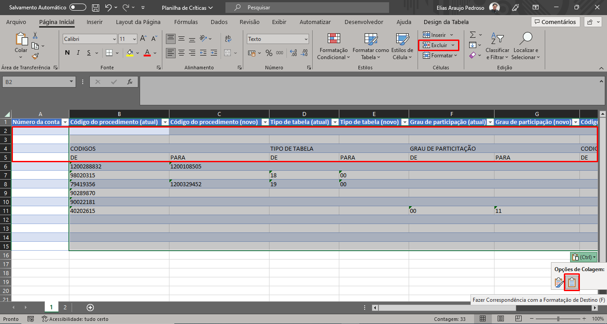
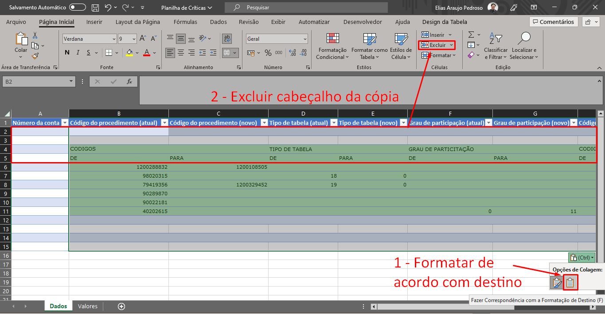
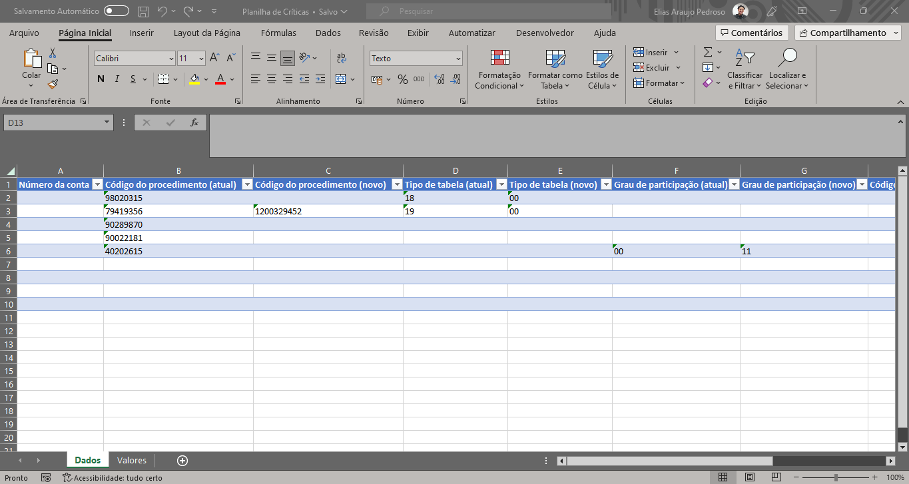

# Como usar o Alterador de Guias TISS

## Pré-requisitos

Para a facilitar o entendimento das funcionalidades e uso do software, é indispensável a leitura da documentação
***(README)*** no diretório raiz.

## 1º Exemplo

Para o seguinte exemplo usaremos o chamado do GLPI HelpDesk: **2022120202**.

### Passos

#### Com o chamado aberto:
<li type="1"><b>Abra a aplicação</b></li>

O executável do software está localizado no caminho: 

[O:\Informatica\Geral\Funcionais\Faturamento de Convênios\Alterador de Guias TISS]([O:\Informatica\Geral\Funcionais\Faturamento de Convênios\Alterador de Guias TISS])

Após executa-lo basta aguardar a janela principal se abrir:

**1 - Abra a planilha de críticas**

Ao clicar no botão ***Abrir planilha***, a planilha responsável por ler as críticas, localizada no diretório raiz será aberta.

**2 - Extração de críticas**

No chamado, o requerente passa as críticas que são necessárias alterações:

Os retângulos em destaque representam as críticas que precisam ser extraídas e serão lidas para as alterações
de **dados** e **valores**, conforme o requerente específica.

**2.1 -  Alteração de dados**

Para extrair as críticas de dados com facilidade, é possível selecionar e copiar as críticas (Ctrl+C).

Em seguida, insira as críticas copiadas na planilha que foi aberta na aba de ***Dados*** e formate conforme instruído 
nas áreas destacadas na imagem abaixo:

Ao final teremos:

**2.2 -  Alteração de valores**

Seguindo o mesmo feito no passo **2.1**, selecionando, copiando e formatando 

**3 - Escolhendo a guia para alteração:**

