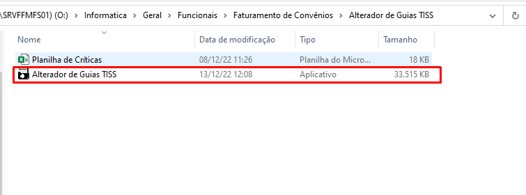
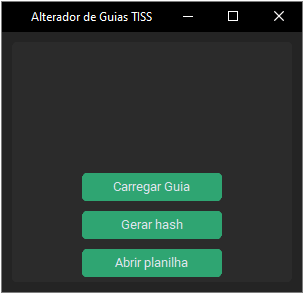

# Alterador de Guias TISS
 
## Prefácio

A ideia inicial desse projeto nasceu da necessidade de uma ferramenta
capaz de realizar alterações de dados em guias TISS (arquivos XML) de forma automatizada, com propósito
de otimizar o tempo gasto para essa tarefa que até então era feita de forma manual através
de editores de texto como ++Notepad, bloco de notas, etc.

## Objetivo

Realizar alterações de dados e/ou valores de forma automática após leitura de critícas informadas pelo requerente,
conforme os chamados: 2022040943, 2022110809 e 2022100571.

## Como utilizar

### Localização do software

O executável do software poderá ser usado sem a necessidade de instalação 
de outros programas e está localizado na seguinte pasta compartilhada:
 
 
</img> 
<a>O:\Informatica\Geral\Funcionais\Faturamento de Convênios\Alterador de Guias TISS</a>  

### Funcionalidades

#### Leitura de críticas

Para realização das alterações, será preciso adicionar as críticas manualmente nas tabelas da planilha localizada no diretório 
raiz do programa.

<i>Tabela 1º Aba - Alteração de dados</i> 

Essa tabela é lida para alteração dos dados de procedimentos como: código de procedimento, tipo de tabela e unidade de medida.

<i>Tabela 2º Aba - Alteração de valores</i> 

Essa tabela é lida para alteração de valores dos procedimentos.

Ao abrir o programa verá a janela principal e alguns botões:
 
 
</img>
 
<ul>
    <li><b>Carregar Guia:</b> abre uma janela para escolha individual de uma guia que deseja realizar alterações;</li> 
    <li><b>Gerar hash:</b> abre uma janela para escolha individual ou em conjunto de guias, após a escolha 
    automaticamente gera um novo código hash e salva a guia no mesmo diretório;</li> 
    <li><b>Abrir planilha:</b> abre a planilha em Excel no diretório raiz</li> 
</ul>
